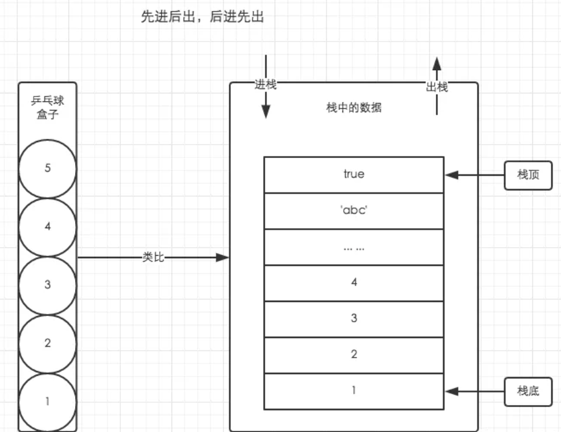
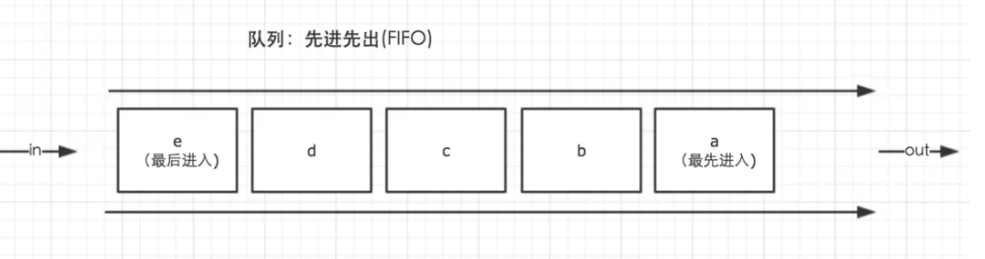
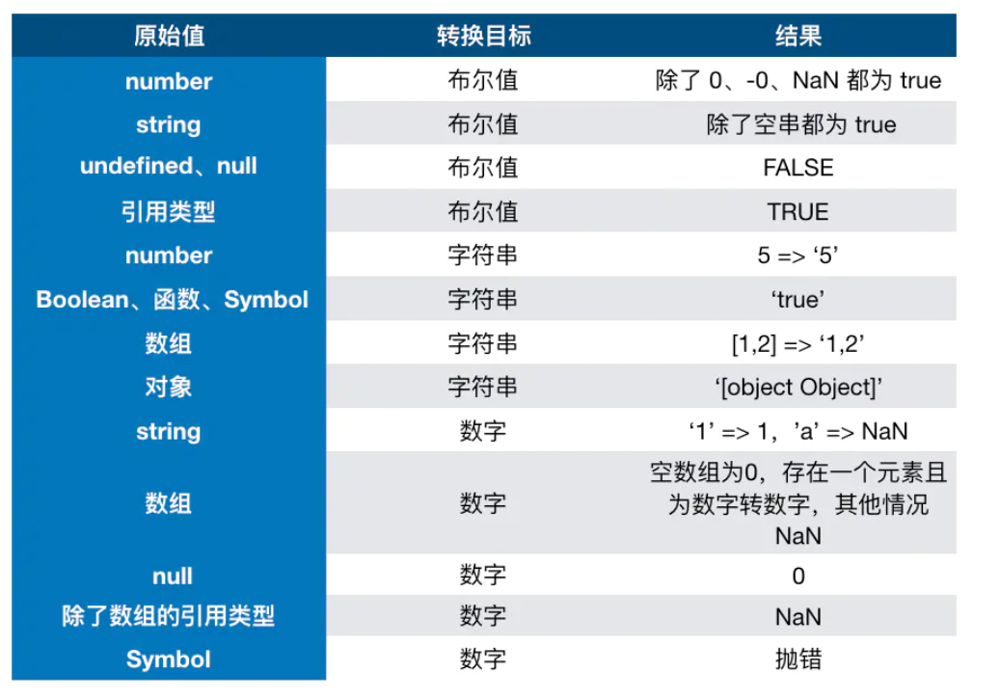
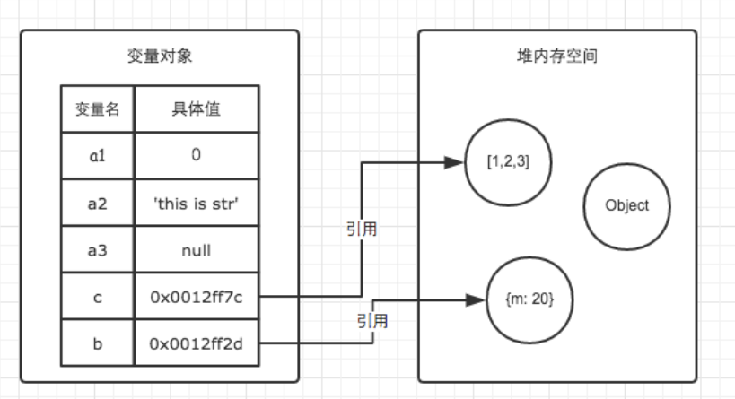
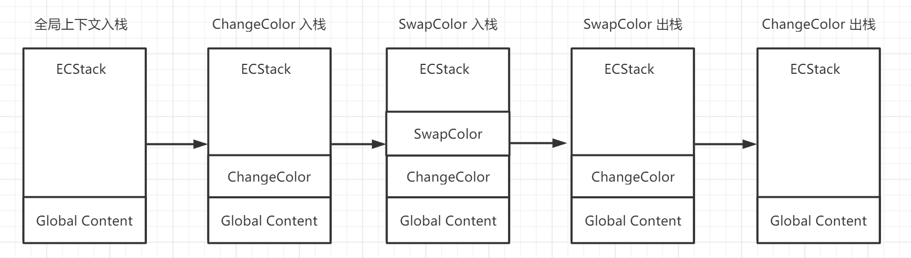
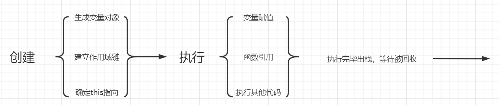
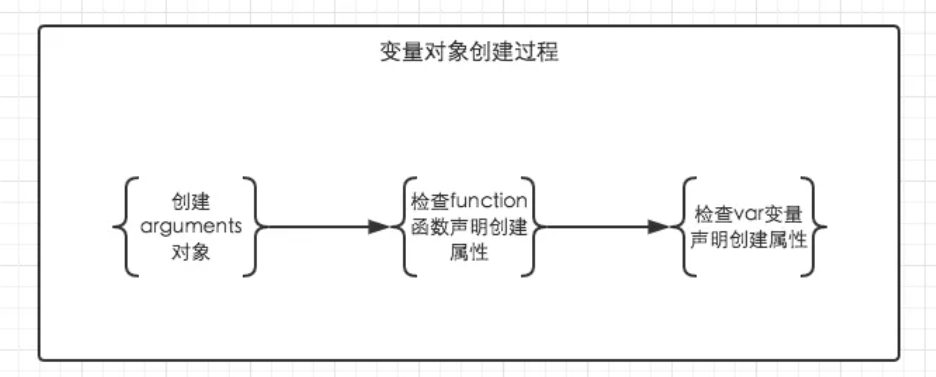
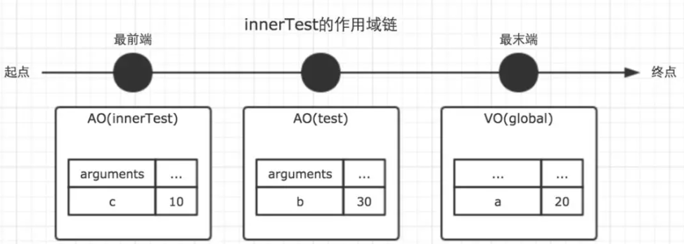

## javascript

### javascript的组成

1、核心： ECMAScript

> ECMAScript是一种可以在宿主环境中执行计算并能操作可计算对象的基于对象的[程序设计语言](https://baike.baidu.com/item/程序设计语言/2317999)。ECMAScript最先被设计成一种Web脚本语言，用来支持Web页面的动态表现以及为基于Web的客户机—服务器架构提供服务器端的计算能力。但作为一种脚本语言， ECMAScript具备同其他脚本语言一样的性质，即“用来操纵、定制一个已存在系统所提供的功能，以及对其进行自动化”

2、文档对象模型：DOM

3、浏览器对象模型： BOM

### es5

ECMAScript的第5版，于2009年标准化。该标准已在所有现代浏览器中完全实现

### es6

第6版ECMAScript，于2015年标准化。该标准已在大多数现代浏览器中部分实施。

### 区别

> ES6是继ES5之后的一次主要改进，语言规范由ES5.1时代的245页扩充至600页。ES6增添了许多必要的特性，例如：模块和类，以及一些实用特性，例如Maps、Sets、Promises、生成器（Generators）等。尽管ES6做了大量的更新，但是它依旧完全向后兼容以前的版本，标准化委员会决定避免由不兼容版本语言导致的“web体验破碎”。结果是，所有老代码都可以正常运行，整个过渡也显得更为平滑，但随之而来的问题是，开发者们抱怨了多年的老问题依然存在。

## 内存空间

- ### 栈数据结构

  与C/C++不同，JavaScript中并没有严格意义上区分栈内存与堆内存。因此我们可以简单粗暴的理解为JavaScript的所有数据都保存在堆内存中。但是在某些场景，我们仍然需要基于栈数据结构的思维来实现一些功能，比如JavaScript的执行上下文。执行上下文的执行顺序借用了栈数据结构的存取方式(即函数调用栈)。



- ### 堆数据结构

  堆数据结构是一种树状结构。它的存取数据的方式，则与书架与书非常相似。

  书虽然也整齐的存放在书架上，但是我们只要知道书的名字，就可以很方便的取出我们想要的书，而不用像从乒乓球盒子里取乒乓一样，非得将上面的所有乒乓球拿出来才能取到中间的某一个乒乓球。好比在JSON格式的数据中，我们存储的`key-value`是可以无序的，因为顺序的不同并不影响我们的使用，我们只需要关心书的名字。

- ### 队列

  在JavaScript中，理解队列数据结构的目的主要是为了清晰的明白事件循环（Event Loop）的机制到底是怎么回事。

  队列是一种先进先出（FIFO）的数据结构。正如排队过安检一样，排在队伍前面的人一定是最先过检的人。用以下的图示可以清楚的理解队列的原理。



- ### 变量对象与基础数据类型

  JavaScript的执行上下文生成之后，会创建一个叫做变量对象的特殊对象（具体会在后续讲到），JavaScript的基础数据类型往往都会保存在变量对象中。

  JavaScript中有5种基础数据类型，分别是`Undefined、Null、Boolean、Number、String`。基础数据类型都是按值访问，我们可以直接操作保存在变量中的实际值。es6新增Symbol

- 在 JS 中类型转换只有三种情况，分别是：

  - 转换为布尔值
  - 转换为数字
  - 转换为字符串

  

- ### 引用数据类型与堆内存

  JavaScript引用数据类型： object包含：Data、function、Array等，引用数据类型的值是保存在堆内存中的对象。JavaScript不允许直接访问堆内存中的数据，因此我们不能直接操作对象的堆内存空间。在操作对象时，实际上是在操作对象的引用而不是实际的对象。

  例：

  ```javascript
  
  var a1 = 0;   // 变量对象
  var a2 = 'this is string'; // 变量对象
  var a3 = null; // 变量对象
  
  var b = { m: 20 }; // 变量b存在于变量对象中，{m: 20} 作为对象存在于堆内存中
  var c = [1, 2, 3]; // 变量c存在于变量对象中，[1, 2, 3] 作为对象存在于堆内存中
  ```

  



提问：

```javascript

// demo01.js
var a = 20;
var b = a;
b = 30;

// 这时a的值是多少？
```

```javascript

// demo02.js
var m = { a: 10, b: 20 }
var n = m;
n.a = 15;

// 这时m.a的值是多少
```

- ### 内存空间管理

  因为JavaScript具有自动垃圾收集机制，所以我们在开发时好像不用关心内存的使用问题，内存的分配与回收都完全实现了自动管理。但是根据以往的开发经验，了解内存机制有助于自己清晰的认识到自己写的代码在执行过程中发生过什么，从而写出性能更加优秀的代码。

  关心内存是一件非常重要的事情。

  JavaScript的内存生命周期

  1.分配你所需要的内存

  2.使用分配到的内存（读、写）

  3.不需要时将其释放、归还

  ```javascript
  
  var a = 20;  // 在内存中给数值变量分配空间
  alert(a + 100);  // 使用内存
  a = null; // 使用完毕之后，释放内存空间
  ```

  JavaScript有自动垃圾收集机制，那么这个自动垃圾收集机制的原理是什么呢？其实很简单，就是找出那些不再继续使用的值，然后释放其占用的内存。垃圾收集器会每隔固定的时间段就执行一次释放操作。

  在JavaScript中，最常用的是通过标记清除的算法来找到哪些对象是不再继续使用的，因此a = null其实仅仅只是做了一个释放引用的操作，让 a 原本对应的值失去引用，脱离执行环境，这个值会在下一次垃圾收集器执行操作时被找到并释放。而在适当的时候解除引用，是为页面获得更好性能的一个重要方式。

  需要注意的是，在局部作用域中，当函数执行完毕，局部变量也就没有存在的必要了，因此垃圾收集器很容易做出判断并回收。但是全局变量什么时候需要释放内存空间则很难判断，因此在我们的开发中，原则上应该避免使用全局变量


## 执行上下文

每次当控制器转到可执行代码的时候，就会进入一个执行上下文。执行上下文可以理解为**当前代码的执行环境**，它会形成一个作用域。JavaScript中的运行环境大概包括三种情况。

- 全局环境：JavaScript代码运行起来会首先进入该环境
- 函数环境：当函数被调用执行时，会进入当前函数中执行代码
- eval（不建议使用，可忽略）

因此在一个JavaScript程序中，必定会产生多个执行上下文，JavaScript引擎会以栈的方式来处理它们，这个栈，我们称其为函数调用栈(call stack)。栈底永远都是全局上下文，而栈顶就是当前正在执行的上下文

当代码在执行过程中，遇到以上三种情况，都会生成一个执行上下文，放入栈中，而处于栈顶的上下文执行完毕之后，就会自动出栈

```javascript

var color = 'blue';

function changeColor() {
  var anotherColor = 'red';

  function swapColors() {
    var tempColor = anotherColor;
    anotherColor = color;
    color = tempColor;
  }

  swapColors();
}

changeColor();
```



> 注：函数中，遇到return能直接终止可执行代码的执行，因此会直接将当前上下文弹出栈。


**总结：**

1.单线程

2.同步执行，只有栈顶的上下文处于执行中，其他上下文需要等待

3.全局上下文只有唯一的一个，它在浏览器关闭时出栈

4.函数的执行上下文的个数没有限制

5.每次某个函数被调用，就会有个新的执行上下文为其创建，即使是调用的自身函数，也是如此。

作业1：

绘制以下代码的演变过程（绘制工具：<https://www.processon.com/>）

```javascript

function f1() {
  var n = 999;
  function f2() {
    alert(n);
  }
  return f2;
}
var result = f1();
result();
```


## 变量对象

在JavaScript中，肯定不可避免的需要声明变量和函数，JS编译器是如何找到这些变量的呢？

当调用一个函数时（激活），一个新的执行上下文就会被创建。一个执行上下文的生命周期可以分为两个阶段。

- **创建阶段**

  在这个阶段中，执行上下文会分别创建变量对象，建立作用域链，以及确定this指向。

- **代码执行阶段**

  创建完成之后，就会开始执行代码，会完成变量赋值，函数引用，以及执行其他代码。



这里变量对象的创建经历以下几个过程：

一、建立arguments对象：检查当前上下文中的参数，建立该对象下的属性与 属性值。

二、检查当前上下文的函数声明，也就是使用function关键字声明的函数。在变量对象中以函数名建立一个属性，属性值为指向该函数所在内存地址的引用

三、检查当前上下文中的变量声明，每找到一个变量声明，就在变量对象中以变量名建立一个属性，属性值为undefined

> 注：如果变量与函数同名，则在这个阶段，以函数值为准

```javascript
console.log(foo); 
function foo() { console.log('function foo') }
var foo = 20;
console.log(foo)
```


```javascript
// 上栗的执行顺序为

// 首先将所有函数声明放入变量对象中
function foo() { console.log('function foo') }

// 其次将所有变量声明放入变量对象中，但是因为foo已经存在同名函数，此时以函数值为准，而不会被undefined覆盖
// var foo = undefined;

// 然后开始执行阶段代码的执行
console.log(foo); // function foo
foo = 20;
```




在JavaScript中有个非常重要的概念，叫做变量提升，根据上面的规则，我们可以很好的理解这个概念，在上面的规则中我们看出，function声明会比var声明优先级更高一点。我们结合一些简单的例子来进行探讨。


```javascript
function test() {
    console.log(a);
    console.log(foo());

    var a = 1;
    function foo() {
        return 2;
    }
}

test();
```

在上例中，我们直接从test()的执行上下文开始理解。全局作用域中运行`test()`时，test()的执行上下文开始创建。为了便于理解，我们用如下的形式来表示

```javascript
// 创建过程
testEC = {
    // 变量对象
    VO: {},
    scopeChain: {}
}

// VO 为 Variable Object的缩写，即变量对象
VO = {
    arguments: {...},  //注：在浏览器的展示中，函数的参数可能并不是放在arguments对象中，这里为了方便理解，我做了这样的处理
    foo: <foo reference>  // 表示foo的地址引用
    a: undefined
}
```

未进入执行阶段之前，变量对象中的属性都不能访问！但是进入执行阶段之后，变量对象转变为了活动对象，里面的属性都能被访问了，然后开始进行执行阶段的操作

> 变量对象和活动对象他们其实都是同一个对象，只是处于执行上下文的不同生命周期。不过只有处于函数调用栈栈顶的执行上下文中的变量对象，才会变成活动对象。

因此，上面的例子demo1，执行顺序就变成了这样

```javascript

function test() {
    function foo() {
        return 2;
    }
    var a;
    console.log(a);
    console.log(foo());
    a = 1;
}

test();
```

作业二：试着写出以下函数的执行顺序

```javascript
function test() {
    console.log(foo);
    console.log(bar);

    var foo = 'Hello';
    console.log(foo);
    var bar = function () {
        return 'world';
    }

    function foo() {
        return 'hello';
    }
}

test();
```

###  全局上下文的变量对象

以浏览器中为例，全局对象为window。全局上下文有一个特殊的地方，它的变量对象，就是window对象。而这个特殊，在this指向上也同样适用，this也是指向window。

除此之外，全局上下文的生命周期，与程序的生命周期一致，只要程序运行不结束，比如关掉浏览器窗口，全局上下文就会一直存在。其他所有的上下文环境，都能直接访问全局上下文的属性。

### let/const

ES6中，新增了使用let/const来声明变量。那么**let/const声明的变量，是否还会变量提升？**

我们来验证下这个问题

```javascript
// 一
console.log(a);

// 二
console.log(a);
let a = 10;
```


**不能在初始化之前访问a**。

这个报错说明了什么问题呢？变量定义了，但是没有初始化。

所以在这里我们就可以得出结论：let/const声明的变量，仍然会提前被收集到变量对象中，但和var不同的是，let/const定义的变量，不会在这个时候给他赋值undefined。

因为完全没有赋值，即使变量提升了，我们也不能在赋值之前调用他。这就是我们常说的**暂时性死区**。

最后，变量提升的现象确实会对我们的代码造成一些负面影响，因此，开发中的好习惯，就是尽量将变量声明放在最前面来写。


## 作用域与作用域链

### 词法环境（Lexical Environments）

官方规范对词法环境的说明是：词法环境（Lexical Environments）是一种规范类型，用于根据ECMAScript代码的词法嵌套结构来定义标识符与特定变量和函数的关联。

官方就是爱把简单的东西复杂化，专业！

通俗来说，词法环境就是一套约定好的规则。我们写代码，应该按照这个规则来。JS引擎对JS源码进行词法分析，也是按照这个规则来。

**因此，词法环境，在我们写代码的时候就已经确定了。**明白了这一点，对于区分词法环境与执行上下文有非常关键的意义。

>  词法环境，其实就是作用域，有的人叫词法作用域等等

得出结论：

一、在JavaScript中，我们可以将作用域定义为一套规则，这套规则用来管理JS引擎如何在当前作用域以及嵌套的子作用域中根据标识符名称进行变量查找。

> 这里的标识符，指的是变量名或者函数名

二、JavaScript中有全局作用域与函数作用域(因为eval我们平时开发中几乎不会用到它，这里不讨论)。


### 作用域链

首先我们要明确的一点是，作用域和作用域链是不同的。

作用域是一套规则。

而作用域链则是在代码执行过程中，会动态变化的一条索引路径。


回顾一下我们刚才讲到的执行上下文的生命周期，如下图。


我们知道函数在调用激活时，会开始创建对应的执行上下文，在执行上下文生成的过程中，变量对象，作用域链，以及this的值会分别被确定。刚才我们详细说明了变量对象，而这里，我们将详细说明作用域链。

**作用域链，是由当前环境与上层环境的一系列变量对象组成，它保证了当前执行环境对符合访问权限的变量和函数的有序访问**

```javascript
// demo
var a = 20;

function test() {
  var b = a + 10;

  function innerTest() {
    var c = 10;
    return b + c;
  }

  return innerTest();
}

test();
```

在上面的例子中，全局，函数test，函数innerTest的执行上下文先后创建。我们设定他们的变量对象分别为VO(global)，VO(test), VO(innerTest)。而innerTest的作用域链，则同时包含了这三个变量对象，所以innerTest的执行上下文可如下表示。

```javascript

innerTestEC = {
  VO: {...},  // 变量对象
  scopeChain: [VO(innerTest), VO(test), VO(global)], // 作用域链
}
```

我们这里使用一个数组来模拟作用域链，数组的第一项scopeChain[0]为作用域链的最前端，而数组的最后一项，为作用域链的最末端，所有的最末端都为全局变量对象。

很多人会误解为当前作用域与上层作用域为包含关系，但其实并不是。以最前端为起点，最末端为终点的单方向通道我认为是更加贴切的形容。如图。



> 注:因为变量对象在执行上下文进入执行阶段时，就变成了活动对象，这一点在上一篇文章中已经讲过，因此图中使用了AO来表示。Active Object

作用域链是由一系列变量对象组成，我们可以在这个单向通道中，查询变量对象中的标识符，这样，就能访问到上一层作用域中的变量。


## 下节预告

1、闭包

2、this指向

3、原型与原型链

4、javascript的事件循环机制
